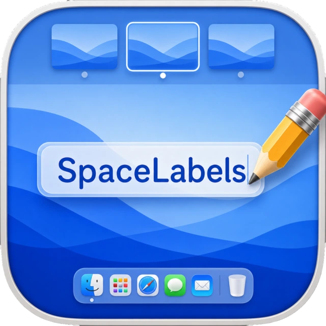
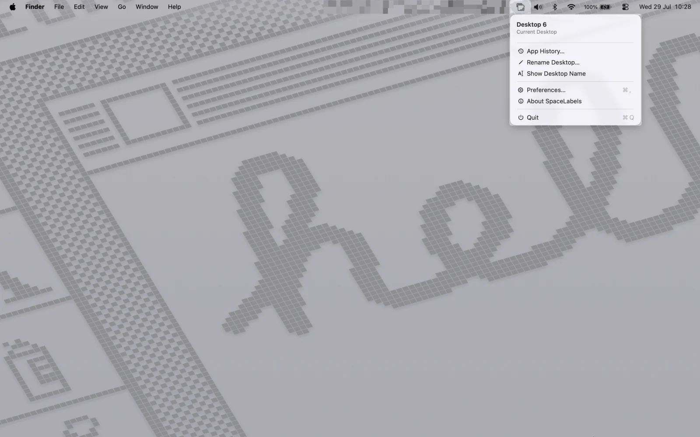
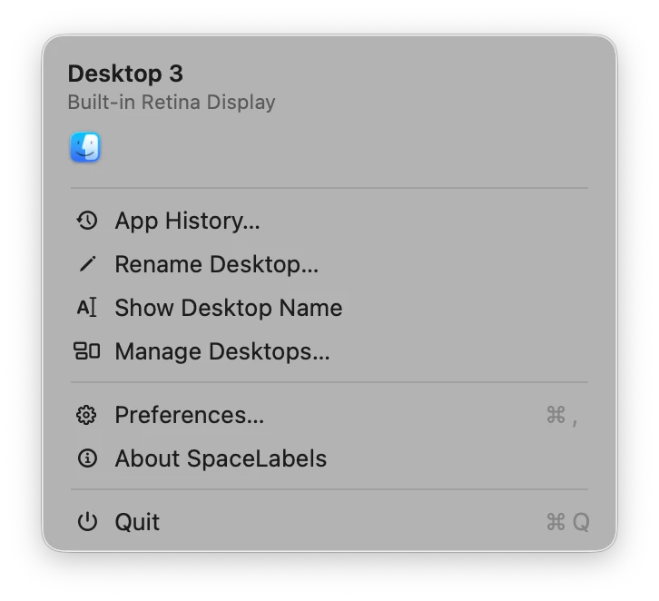
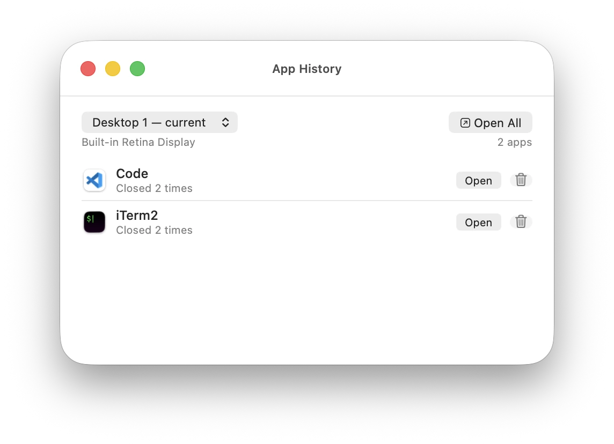
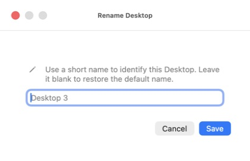
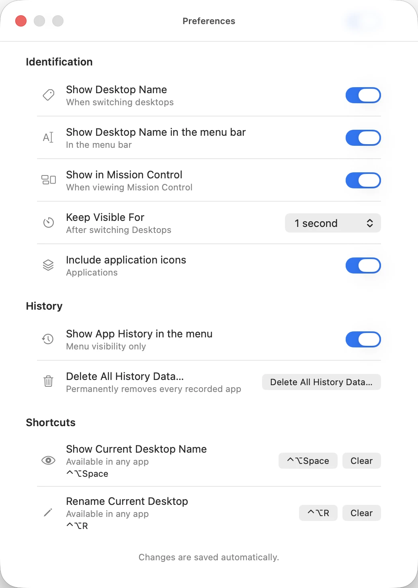

# SpaceLabels

**Name every Space on your Mac.** Recognize each context at a glance. When you
switch Spaces, SpaceLabels briefly shows the Space name and its visible apps —
without opening Mission Control.

<p>
  <a href="https://igortice.github.io/spacelabels/">Open the website</a> ·
  <a href="https://igortice.github.io/spacelabels/pt-BR/">Português</a> ·
  <a href="https://github.com/igortice/spacelabels/releases/latest">Download the latest Release</a> ·
  <a href="https://github.com/igortice/spacelabels/issues">Report a bug or suggest an improvement</a>
</p>

This repository is the public distribution home for SpaceLabels. It contains
the GitHub Pages site, public Releases, checksums, installation information and
the real product captures used below. The Swift source code and app test suite
remain in the private development repository.

## What SpaceLabels does

- **Shows the current Space in the menu bar.** The current Space, visible apps
  and main actions are one click away inside macOS.
- **Confirms a Space switch with a native HUD.** The HUD shows the active Space
  and up to four visible apps, never takes focus and fades after the configured
  interval.
- **Keeps local App History by Space.** While SpaceLabels is running, closed
  apps can be listed for their Space and requested again when you return.
- **Rename Spaces.** Replace “Desktop 3” with a short name that makes
  sense to you.
- **Adapts to your workflow.** Preferences control HUD duration, app icons and
  how the signal behaves in Mission Control.

The app is free, runs on **macOS 15 or later**, and keeps its data on your Mac.
There is no account, cloud, or telemetry.

## See the real app

These are captures from SpaceLabels 1.3.0, not invented product mockups.














For the complete visual walkthrough, including the Portuguese translation, see
the [SpaceLabels website](https://igortice.github.io/spacelabels/).

## Install SpaceLabels

1. [Download the latest DMG](https://github.com/igortice/spacelabels/releases/latest)
   from the public Releases page.
2. Open the downloaded DMG.
3. Move SpaceLabels to Applications.
4. Open it from Finder's context menu and choose **Open** if macOS asks for a
   first-launch confirmation through Gatekeeper. This public bundle
   is ad hoc signed and is not notarized.
5. Use the SpaceLabels icon in the menu bar.

No installer account or additional service is required.

## Release and checksum

The [latest public Release](https://github.com/igortice/spacelabels/releases/latest)
is the source of truth for the current version, DMG and checksum. The public
site reads and validates that Release before enabling its download; if the
Release cannot be validated, the site stays fail-closed.

The current reference Release is **v1.3.0**:

- DMG: `SpaceLabels-1.3.0.dmg` (2.7 MB)
- SHA-256:
  `5d68bcf6d08165eba79a8fd8323585b62e0a8ecee1c567aaa5722020e44fc844`
- [Download the DMG directly](https://github.com/igortice/spacelabels/releases/download/v1.3.0/SpaceLabels-1.3.0.dmg)
- [Download the checksum file](https://github.com/igortice/spacelabels/releases/download/v1.3.0/SpaceLabels-1.3.0.dmg.sha256)

To verify a downloaded DMG locally:

```bash
shasum -a 256 SpaceLabels-1.3.0.dmg
```

Compare the output with the digest above or with the `.sha256` file from the
same Release. When a newer version is published, use its version-specific
checksum instead of the v1.3.0 reference.

### v1.3.0 highlights

- App History for the current Space.
- Reopen one app or all apps from a Space's History.
- Browse the History of another Space or all Spaces.
- Remove History entries with local logical deletion.
- Privacy controls and permanent History deletion.

## Feedback, not a support desk

Use the public [GitHub Issues](https://github.com/igortice/spacelabels/issues)
to report a reproducible bug or suggest an improvement. Issues are the public
feedback channel for bugs and suggestions. There is no dedicated support desk
or SLA, and no response time is promised.

Please include your macOS version, SpaceLabels version, the steps to reproduce
the problem and any relevant screenshots. Do not attach private data or
secrets.

## Português

O SpaceLabels dá nomes às Mesas do macOS, mostra a Mesa ativa e mantém o
Histórico local dos aplicativos de cada contexto. Ele é gratuito, funciona no
macOS 15 ou superior e não exige conta, nuvem ou telemetria.

- [Abrir o site completo em português](https://igortice.github.io/spacelabels/pt-BR/)
- [Baixar a Release pública mais recente](https://github.com/igortice/spacelabels/releases/latest)
- [Relatar um problema ou sugerir uma melhoria](https://github.com/igortice/spacelabels/issues)

Para instalar: baixe e abra o DMG, arraste o SpaceLabels para Aplicativos e,
se o macOS pedir confirmação na primeira abertura, escolha **Abrir** no Finder.
O site em português contém a explicação visual completa, os detalhes da versão
e o checksum validado.

## Run the public site locally

The static Pages site lives in the root of `main`:

- `index.html` — English route (default)
- `pt-BR/index.html` — complete Portuguese route
- `assets/` — public captures, styles and release metadata

To preview it locally:

```bash
python3 -m http.server 4173
```

Then open <http://localhost:4173>.

To validate the page, release contract, localization and README links:

```bash
npm test
```

The site uses no framework, analytics or cookies. The public repository does
not contain the private Swift source code.
